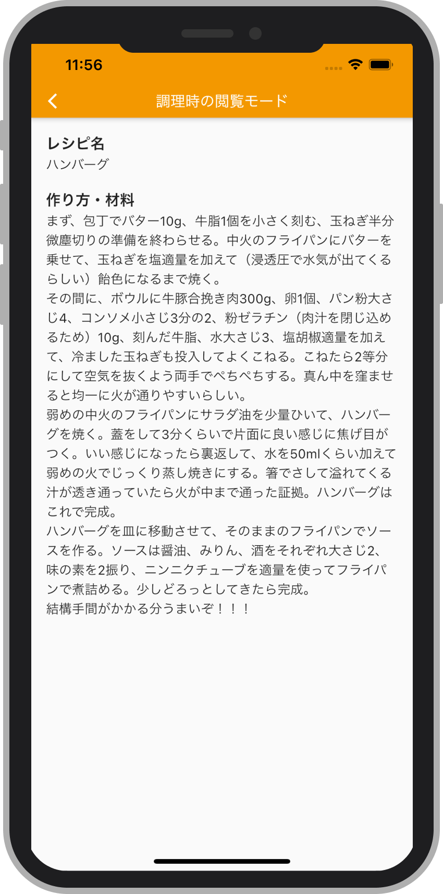

# シンプルなレシピ

Flutter & Firebase 製のレシピ管理・投稿アプリ

| 検索画面 | レシピ画面 | 調理時の閲覧画面 |
| --- | --- | --- |
||||

## シンプルなレシピについて

本リポジトリは、[KBOY の Flutter 大学](https://www.youtube.com/channel/UCReuARgZI-BFjioA8KBpjsw) のオンラインサロンのメンバー数名で行った、2020年10月にスタートした共同開発プロジェクトのひとつです。

「シンプルなレシピ」は、主たる開発者/プロダクトオーナーである [@KosukeSaigusa](https://github.com/KosukeSaigusa)（本リポジトリのオーナー）が日々色々なツールを試しながら行っていた料理の記録を、シンプルな操作性と UI によって投稿・管理し、調理時の汚れたり濡れたりした手で画面をスクロールする必要なく、作り方を参照しながら料理をするためのアプリケーションを作成したいという考えで開発されました。