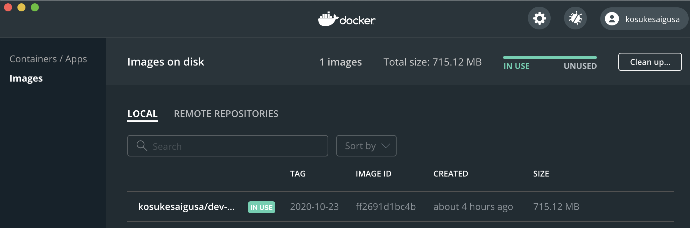
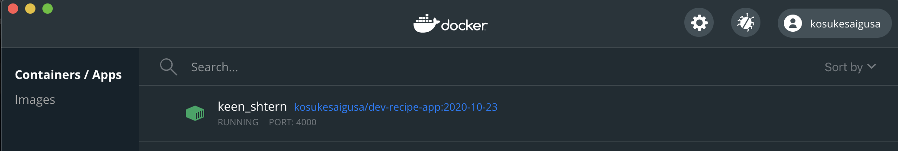
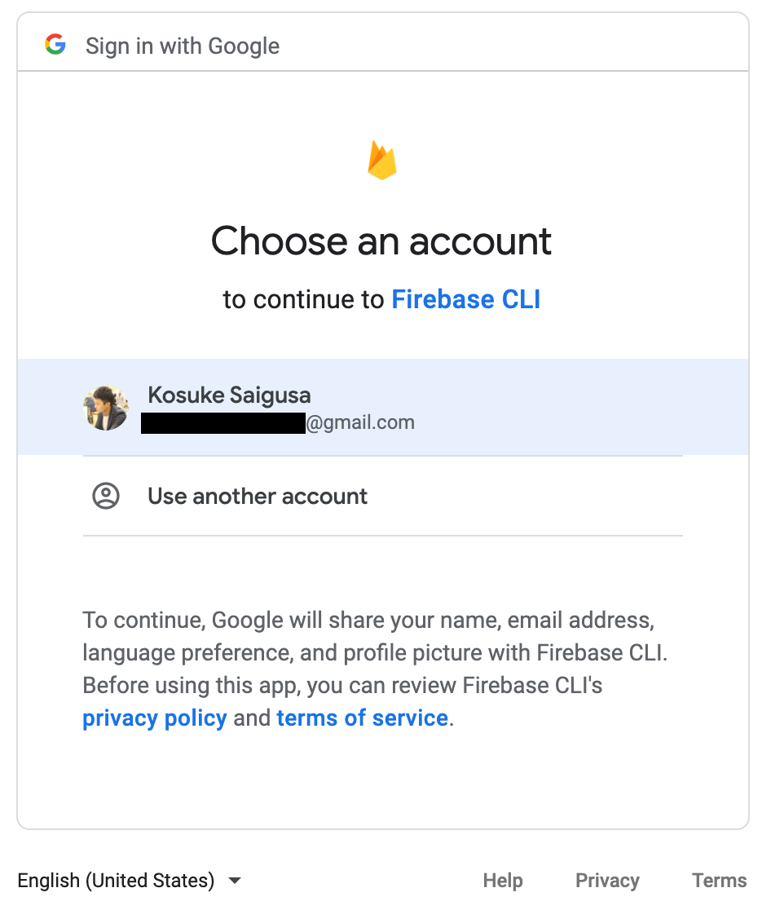
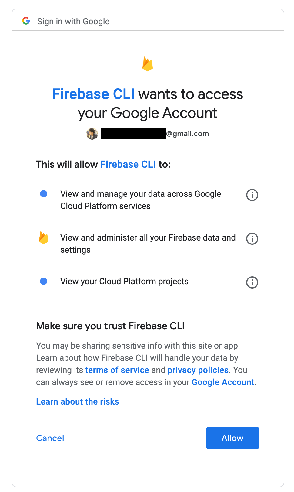
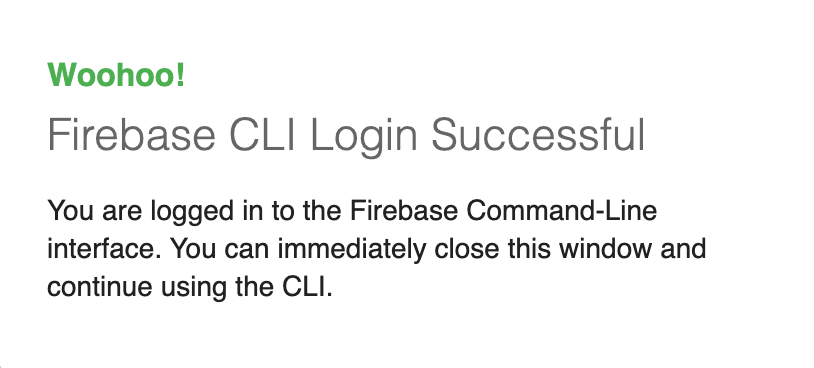
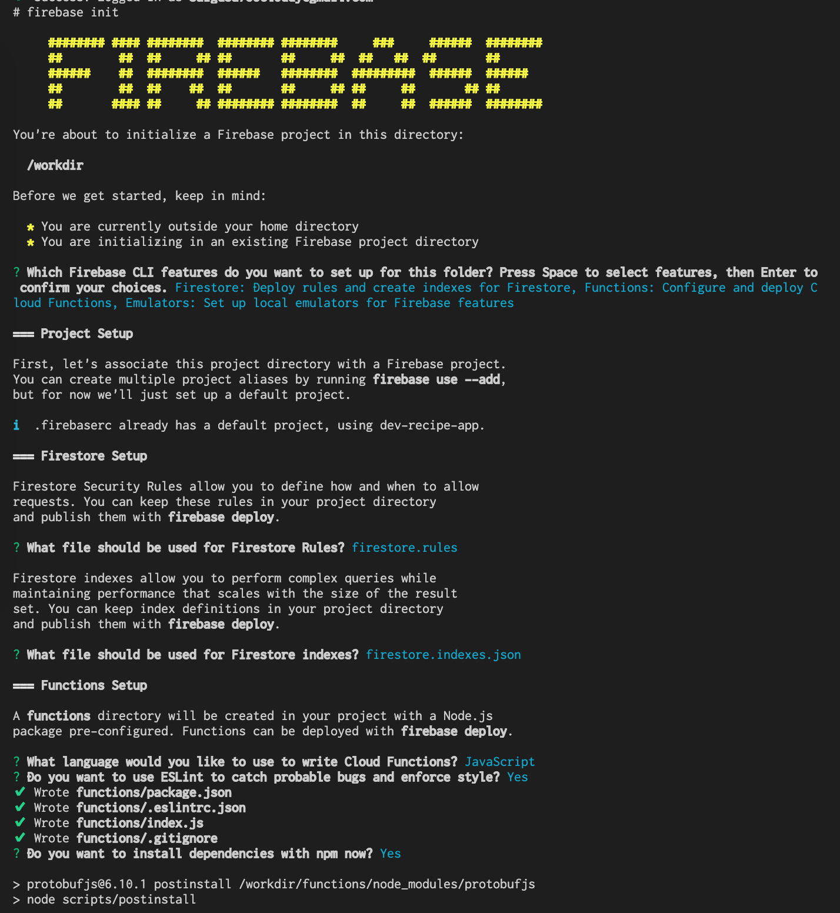
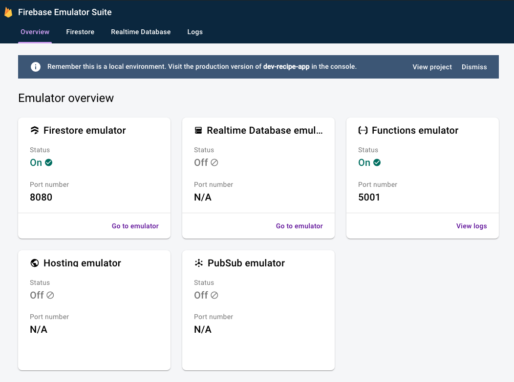

# Firebase CLI の設定

ここでは、Firebase CLI の設定方法を説明します。

Firebase CLI の設定とは、Firestore Security Rules や Cloud Functions などの編集・デプロイなどを、[Firebase Console](https://console.firebase.google.com/) ではなく、ローカルで行えるようにするための設定です。

「ローカルで行えるようにする」と表現してはいますが、今回は、個々のローカルマシンにそのような環境を構築するのではなく、Docker を用いて個々のローカルマシンとは切り離された環境で行い、それをローカルマシンから操作・実行できるようにする方法を採用することにしました。それぞれのローカルマシンの Node や npm の環境を汚したり、共同開発メンバー間でのローカルマシンの違いによって発生し得る問題を回避することなどを意識したためです。

## 参考にした情報

* [Qiita 「Cloud Functionsで消耗したくない人のために、開発環境のベストプラクティスをまとめていったらDockerに行き着いた話」](https://qiita.com/pannpers/items/244a7e3c18d8c8422e4f#%E9%96%A2%E6%95%B0%E3%81%8C%E3%83%87%E3%83%97%E3%83%AD%E3%82%A4%E3%81%95%E3%82%8C%E3%82%8B%E3%83%AA%E3%83%BC%E3%82%B8%E3%83%A7%E3%83%B3%E3%82%92%E6%8C%87%E5%AE%9A)
* [Qiita「Dockerを体系的に学べる公式チュートリアル和訳」 ](https://qiita.com/Michinosuke/items/5778e0d9e9c04038903c)
* [Github レポジトリ 公式チュートリアル](https://github.com/docker/getting-started)
* [NuxtJs2.13 + FirebaseプロジェクトをDockerを使ってコンテナ化](https://medium.com/anti-pattern-engineering/nuxtjs2-13-firebase%E3%83%97%E3%83%AD%E3%82%B8%E3%82%A7%E3%82%AF%E3%83%88%E3%82%92docker%E3%82%92%E4%BD%BF%E3%81%A3%E3%81%A6%E3%82%B3%E3%83%B3%E3%83%86%E3%83%8A%E5%8C%96-e286eaae0e55)
* [Firebase 公式 CLI リファレンス](https://firebase.google.com/docs/cli?hl=ja#linux)
* [Firebase 公式 Set up the Firebase Emulators](https://firebase.google.com/docs/rules/emulator-setup)

## Docker のインストールと Docker Hub への登録

Docker for Desktop がまだローカルマシンにインストールされていない場合は、[Docker for Desktop のダウンロードページ](https://hub.docker.com/editions/community/docker-ce-desktop-mac/) からインストールしておきます。

また、Docker Hub へのアカウント登録が済んでいない場合には、[Docker Hub](https://hub.docker.com/) から済ませておくのが良いでしょう。

## Dockerfile の設定

<u>**\* 共同開発メンバー：この設定は、Github レポジトリを pull した時点で不要な手続きです。**</u>

今回は、上述の通り、Firebase の Firestore Security Rules と Cloud Functions をローカルで編集し、エミュレータも起動できるように、Docker コンテナの構成情報を記述するためのファイルである `Dockerfile` は下記のような内容で記述しました。

```Dockerfile
FROM ubuntu:latest

WORKDIR /workdir

# apt を最新にして sudo, curl コマンドをインストール
RUN apt-get -y update && apt-get install -y sudo curl

# Java の環境のインストール
RUN apt-get install -y openjdk-8-jdk

# Firebase CLI のインストール
RUN curl -sL "https://firebase.tools" | bash

# Node.js と npm のインストール
RUN apt install -y nodejs npm

# エミュレータの設定
ENV HOST 0.0.0.0
EXPOSE 4000
EXPOSE 5001
EXPOSE 8080

# Firebase ログインに必要なポート
EXPOSE 9005
```

## Docker イメージのビルド

Dockerfile からイメージを作成することをビルドと言います。

まずは、任意のディレクトリ（今回は `Flutter アプリの root/firebase` の下） `Dockefile` という名前のファイルを作成します。拡張子は必要ありません。

```
touch <Flutter アプリの root/firebase>/Dockerfile
```

次に `Dockerfile` が配置されているディレクトリに移動します。

```
$ cd <Dockerfile までのパス>
```

次のコマンドで、Docker イメージをビルドすることができます。

```
$ docker build -t <適当なパス>:<適当なタグ> .
```

少し補足すると、

* `-t` は、タグを付けて同名の Docker イメージを区別するためのオプションを意味している
* タグ名は、`<適当なパス>` の後ろにコロンで続けて、`:<適当なタグ>` のように記述する
* 最後の 半角ピリオド `.` で、イメージビルドの元にする Dockerfile のパス（つまり現在のディレクトリ）を示している

という感じです。

今回は、私のユーザー名である `kosukesaigusa` と、レシピアプリの開発 (development) 環境に相当する Firebase プロジェクトに関する設定であることが分かるような Docker イメージ名として `dev-recipe-app` を組み合わせ、タグは適当に作成日である `2020-10-23` を採用して、具体的には下記のようなコマンドを実行しました。

```
$ docker build -t kosukesaigusa/dev-recipe-app:2020-10-23 .
```

処理が完了すると、下図のように、Docker for Desktop に Docker イメージが作成されています。



## Docker コンテナの起動

上で作成したイメージを元にしたコンテナを、下記のコマンドで作成・起動することができます。

```
$ docker run -it -p 4000:4000 -p 5001:5001 -p 8080:8080 -p 9005:9005 -v $PWD:/workdir kosukesaigusa/dev-recipe-app:2020-10-23 /bin/sh
```

ここでも少し補足すると、

* `-it` のオプション（`-i` と `-t` の組み合わせ）によって、起動後、コンテナ内の操作が可能にする
* `-p <ホスト側ポート>:<コンテナ側ポート>` で、ホスト側・コンテナ側のそれぞれのポートを割り当てる
* `-v $PWD:/workdir` で、ローカルマシンの特定のディレクトリ（この例では、コロンの左側は `$PWD` つまり、現在の `Dockerfile` の存在するディレクトリ）をコンテナ内の特定のディレクトリ（この例では、コロンの右側は `/workdir` つまり、コンテナの `root/workdir` のディレクトリ）にマウントする

ということです。

実行すると、下図のように、Docker Desktop に新たなコンテナが作成されて、緑色の実行状態になります。



この状態から出るには、`exit` というコマンドを入力します。

```
# exit
```

`exit` すると、実行中のステイタスを意味する緑色に光っていたコンテナは、`exited` というステイタスに変わって、グレーアウトされます。

再度、上述の `docker run ...` のコマンドでコンテナを起動しましょう。

```
$ docker start <コンテナ名 or コンテナ ID>
```

コンテナIDは `ps` (process status) コマンドと `-a` (all) オプションで、起動中と停止中のものを含めてすべて表示することができます。

```
$ docker ps -a
```

コンテナを起動した後に、そのコンテナの中に入るには次のコマンドを実行します。

```
docker exec -it <コンテナ名 or コンテナ ID> bash
```

コンテナを起動した状態で `firebase --version` のコマンドをターミナルに入力すると、ローカルマシンからは切り離された環境に、Firebase CLI がインストールされていること、およびそのバージョンを確認することができます。

```
# firebase --version
8.13.1
```

Java のバージョンの確認も同様です。

```
# java -version
openjdk version "1.8.0_265"
OpenJDK Runtime Environment (build 1.8.0_265-8u265-b01-0ubuntu2~20.04-b01)
OpenJDK 64-Bit Server VM (build 25.265-b01, mixed mode)
```

## Firebase CLI の有効化

それでは、先程作ったコンテナを再度起動して、Firebase CLI の有効化を行います。

上述の方法でコンテナを起動しその中に入った上で、まずは、Firebase にログインします。

```
# firebase login
```

認証用の URL がターミナルに現れます。自動でブラウザは開かないので、手動でその URL をブラウザにコピーしてアクセスし、下図のように認証を済ませて下さい。







上図のような表示なればログインに成功しています。

次のコマンドを実行すると、現在ログインしている Firebase アカウントでアクセス可能なプロジェクト一覧が表示されます。

```
firebase projects:list
```

## Firebase CLI の初期化

<u>**\* 共同開発メンバー：この設定は、Github レポジトリを pull した時点で不要な手続きです。**</u>

次にローカルで操作する Firebase プロジェクトを初期化します。下記のコマンドを入力し、状況に応じて使用するツールを選択し、設定を行って下さい。

```
# firebase init
```

今回は、

* Firestore Security Rules
* Cloud Functions
* 両者のローカル Emulator およびその UI

に関して、下図のように設定を進めました。





Firebase initialization complete! というメッセージが現れれば完了です。

次に、上の作業の間に生成された `firebase.json` ファイルの編集を行います。エミュレーターを起動した際に、ブラウザで `localhost:<ポート>` でアクセスできるようするための設定です。

```firebase.json
{
  "firestore": {
    "rules": "firestore.rules",
    "indexes": "firestore.indexes.json"
  },
  "functions": {
    "predeploy": [
      "npm --prefix \"$RESOURCE_DIR\" run lint"
    ],
    "source": "functions"
  },
  "emulators": {
    "functions": {
      "host": "0.0.0.0",
      "port": 5001
    },
    "firestore": {
      "host": "0.0.0.0",
      "port": 8080
    },
    "ui": {
      "enabled": true,
      "host": "0.0.0.0",
      "port": 4000
    }
  }
}
```

編集したのは、

* emulators > functions に `"host": "0.0.0.0"` を追記
* emulators > firestore に `"host": "0.0.0.0"` を追記
* emulators > ui に `"host": "0.0.0.0"` と `"port": 4000` を追記

の 3 箇所です。

## エミュレータの起動

Docker コンテナを起動した状態で、次のコマンドで Firestore および Funtions のエミュレータを起動することができます（念のため Firebase のログイン状態も事前に再確認しておくと良いでしょう）。

```
# firebase login
# firebase emulators:start
```

この後、`http://0.0.0.0:4000/` にアクセスした際に、下図のような Firebase Emulator Suite が表示されていれば正常です。



Firestore emulator からは、Security Rule のテストの実行などを、Functions emulator からは、Cloud Functions の実行ログの確認などを行うことができます。

エミュレータは `control C` のキー入力でストップすることができます。

たとえば Functions ではなく、Firestore のエミュレータだけを起動したい場合には、

```
firebase emulators:start --only firestore
```

のように `--only` オプションのコマンドを実行すれば OK です。

デプロイには `deploy` コマンドを用いて、

```
firebase deploy --only firestore:rules
```

```
firebase deploy --only functions
```

などとすることができます。

また、開発・検証用の環境に対応する Firebase プロジェクトで正しく動作することを確認できた後、プロダクション版のプロジェクトについても同じ内容をリリースしたい場合には、デプロイコマンドのオプションとして `--project=<デプロイ先のプロジェクト名>`

```
firebase deploy --only functions --project=<デプロイ先のプロジェクト名>
```

とすることができます。

## その他のメモ

Cloud functions に設定済みの環境変数を確認：

```
firebase functions:config:get
```

Cloud functions に環境変数を設定（サービス名：`slack`, キー：`uri`, 参考：[Google 公式](https://firebase.google.com/docs/functions/config-env?hl=ja)）：

```
firebase functions:config:set slack.uri=https://hooks.slack.com/services/XXX
```