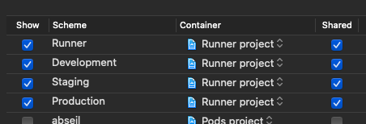
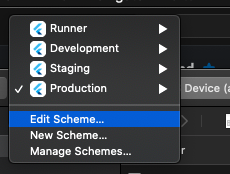

# 環境設定

## 環境ごとのビルド設定 (iOS)

ここでは、iOS でのビルドにおける、環境ごとのビルド設定の概要と設定方法をまとめます。

参考にしたのは下記のような情報です。

* [Medium mono さん：「Flutterで環境ごとにビルド設定を切り替える — iOS編」](https://medium.com/flutter-jp/flavor-b952f2d05b5d)
* [Github リポジトリ（上記 mono さんの記事に対応）](https://github.com/mono0926/flutter-flavor-example/blob/develop/ios/Runner/Info.plist)
* [Qiita 「flutterで本番/ステージング/開発を切り替える」](https://qiita.com/ko2ic/items/53f97bb7c28632268b5a)

環境のバリエーションは、開発環境、テスト環境、本番環境をそれぞれ、

* Development 環境
* Staging 環境
* Production 環境

と表現することとします。

今回はそれぞれの環境の種類、ビルドモード、Flavor、Configuration 名を合わせて、下表の3種類の設定を行います（より本格的には、開発中の実装のパフォーマンスを実機リリースモードで確かめるための Debug-Relase のような環境があっても良いでしょうが）。

| 種類 | ビルドモード | Flavor | Configuration 名 |
| ---- | ---- | ---- | ---- |
| 開発 | Debug | Development | Debug-Development |
| テスト | Release | Staging | Release-Staging |
| リリース | Release | Production | Release-Production |

また、それぞれの環境におけるアプリ名および Product Bundle Identifier は下記の通りです。

* Debug-Development 環境：Dev Recipe (com.kosukesaigusa.recipe.development)
* Release-Staging 環境：Staging Recipe (com.kosukesaigusa.recipe.staging)
* Release-Production 環境：シンプルなレシピ (com.kosukesaigusa.recipe)

Flutter の新規プロジェクトを作成したら、

```
open ios/Runner.xcworkspace
```

で XCode を開きます。

XCode Menu > Product > Scheme > Manage Schemes

から、左下の「+」ボタンをクリックし、

* Target: Runner
* Name: Develpment

を入力して次へ進みます。同様に、Staging, Production についても Scheme を追加します。これらの Flavor バリエーションは、チームにも共有するので、「Shared」にもチェックをつけておき、下図のようになります。



次に、Configuration の追加を行います。初期状態では、Runner > Project > Runner をクリックした画面の Configurations に、

* Debug
* Release
* Profile

だけが存在しているので、今回新たに定義する

* Debug-Development
* Release-Staging
* Release-Production

も追加する必要があります。

Runner > Project > Runner をクリックした画面の Configurations の下部の「+」ボタンを押し、Debug-Development は既存の Debug から、Release-Staging と Release-Production は既存の Release から複製して設定します。

この段階で、ターミナルで対象アプリの `ios` ディレクトリに移動して、

```
flutter run --debug --flavor development
```

コマンドを実行すると、とりあえずアプリの起動に成功するようになります。

しかし、ここまででは、まだ Flavor の違いがアプリケーションの振る舞いの違いに反映されません。そこで、以下のように、Configuration ごとの xcconfig ファイルを設定します。

XCode で、Runner > Flutter 配下の、

* `Debug.xcconfig`
* `Release.xcconfig`
* `Profile.xcconfig` （場合によっては存在しないかも）

が元々存在している箇所で右クリックを押し、New File > Configuration Settings File を選択し、

* ファイル名: `Development.xcconfig`
* 保存場所：`recipe/ios/Flutter`
* Group: Flutter
* Target: Runner にチェック

のようにして、新たに Configuration ファイルを作成します。

* `Staging.xcconfig`
* `Production.xcconfig`
* `Debug-Development`
* `Release-Staging`
* `Release-Production`

についても同様にファイルを新規作成します。

各 Configuration ファイルの内容は、[本プロジェクトの各ファイル]()のような内容にします。そこに実行環境ごとに別アプリ扱い、別アプリ名とするための設定に関わる内容 (`FLUTTER_FLAVOR`, `PRODUCT_BUNDLE_IDENTIFIER`, `DISPLAY_NAME`) が記述されています。

少し内容を補足すると、

* `FLUTTER_FLAVOR` は、ビルド時の Flavor 設定で、`development`, `staging,` `production` の三択
* `PRODUCT_BUNDLE_IDENTIFIER` は、別アプリとして区別するための情報で、`com.kosukesaigusa.recipe.development`, `com.kosukesaigusa.recipe.staging`, `com.kosukesaigusa.recipe` の三択
* `DISPLAY_NAME` は、別アプリとした扱うときのそれぞれのアプリ名

という感じです。

これを反映させるために、XCode で Runner > Project > Runner > Build Settings (All, Combined を選択) > Packaging > Product Bundle Identifier の値を、それぞれ

* Debug: `com.kosukesaigusa.recipe.development`
* Debug-Development: `com.kosukesaigusa.recipe.development`
* Rlease: `com.kosukesaigusa.recipe`
* Rlease-Production: `com.kosukesaigusa.recipe`
* Rlease-Staging: `com.kosukesaigusa.recipe.staging`

のように設定します。


Runner > Runner > info.plist には、

```
<key>FlutterFlavor</key>
<string>$(FLUTTER_FLAVOR)</string>
```

のペアを追加しておき、Bunlde name はリリース版のアプリ名に相当する「シンプルなレシピ」としておきましょう。

```
<key>CFBundleName</key>
<string>シンプルなレシピ</string>
```


---

次に、Firebase を環境ごとに設定する方法をまとめます。

Firebase プロジェクトは、上記の3つの環境 (Development, Staging, Production) にそれぞれ1つずつ作成して準備します。今回は、下記のような名前で作成しました。

* dev-recipe-app（開発用）
* staging-recipe-app（テスト用）
* recipe-app（リリース用）

Project settings の Default GCP resource location は、東京に相当する `asia-northeast1` にしておきました。

「Add app」のボタンから iOS アプリを追加します。iOS bundle ID は、Development, Staging, Production に対して、それぞれ

* `com.kosukesaigusa.recipe.develop`
* `com.kosukesaigusa.recipe.staging`
* `com.kosukesaigusa.recipe`

とし、それぞれから得られる `GoogleService-Info.plist` は、

* `GoogleService-Info-Development.plist`
* `GoogleService-Info-Staging.plist`
* `GoogleService-Info-Production.plist`

と名前を変更しておきます。

これらの3つのファイルを、XCode で新たに作成した Runner > Runnter > Firebase ディレクトリにドラッグ & ドロップで追加します（Finder などで追加すると、XCode 側に認識されません）。


面倒なやり方ですが、ビルド時に、そのビルドモードに合わせて、`Runner/Runner/Firebase` ディレクトリの適当な `GoogleService-Info-XXX.plist` のファイルを選択し、それを `Runner/Runner` ディレクトリに上書きコピーすることで対応します。

そのような、ビルド時の特定のスクリプトの自動実行の設定は、Runner > Targets > Runner > Build Phases から行います。


この画面の上部の「+」ボタンで、New Run Script Phase を選択し、わかりやすさのために、スクリプト名をデフォルトの「Run Script」から任意に「Replace Google Service Info」などと書き換えておきます。

スクリプトの中身は下記のような内容です。

```
echo "--------------------"
echo "PRODUCT_NAME: ${PRODUCT_NAME}"
echo "CONFIGURATION: ${CONFIGURATION}"
echo "SRCROOT: ${SRCROOT}"
echo "PRODUCT_BUNDLE_IDENTIFIER: ${PRODUCT_BUNDLE_IDENTIFIER}"
echo "--------------------"

if [[ "${CONFIGURATION}" == "Debug-Development" ]]; then
    rm $PRODUCT_NAME/GoogleService-Info.plist
    cp $PRODUCT_NAME/Firebase/GoogleService-Info-Development.plist $PRODUCT_NAME/GoogleService-Info.plist
    echo "GoogleService-Info-Production.plist copied."
elif [[ "${CONFIGURATION}" == "Release-Staging" ]]; then
    rm $PRODUCT_NAME/GoogleService-Info.plist
    cp $PRODUCT_NAME/Firebase/GoogleService-Info-Staging.plist $PRODUCT_NAME/GoogleService-Info.plist
        echo "GoogleService-Info-Production.plist copied."
elif [[ "${CONFIGURATION}" == "Release-Production" ]]; then
    rm $PRODUCT_NAME/GoogleService-Info.plist
    cp $PRODUCT_NAME/Firebase/GoogleService-Info-Production.plist $PRODUCT_NAME/GoogleService-Info.plist
    echo "GoogleService-Info-Production.plist copied."
else
    echo "configuration didn't match to Development, Staging or Production"
    echo $CONFIGURATION
    exit 1
fi
```

Output Files には、明示的に、`$SRCROOT/Runner/GoogleService-info.plist` と記載しておきます。

こうすることで、ビルドを行う度に、そのビルドモードに対応した `GoogleService-info.plist` が作成（置換）されることになります。

新たに作ったこの Run Script は、元々存在している Run script の下に XCode 上でドラッグ & ドロップをして移動しておきました。

Android Studio で開発しながら、それぞれのビルドモードで実行するためには、画面上部、Simulator の選択ボックス右隣の Edit Configurations を追加します。


それぞれ

* Name: `Debug-Development`
* Name: `Release-Staging`
* Name: `Release-Production`

に対して、

Additional Arguments として、

* `--debug --flavor development --dart-define=FLAVOR=development`
* `--release --flavor staging --dart-define=FLAVOR=staging`
* `--release --flavor production --dart-define=FLAVOR=production`

Build Flavor として、

* `development`
* `staging`
* `production`

を記入しておきましょう。

また、XCode側でも同様に、Edit Schemes から、それぞれのビルドモードに合わせた環境変数を設定します。



Development, Staging, Release のそれぞれのビルドモードに対して、Edit Scheme > Run から、

* Info > Build Configuration: `Debug-Devlopment`, `Release-Staging`, `Release-Production` のうちの適切なもの
* Arguments > Environment Variables: `development`, `staging`, `production` のうちの適切なもの

を設定して下さい。

また、Release モードのビルド（Release-Staging と Release-Production）は、実機でしか実行できないことにも留意しておきましょう。

以上で、iOS における環境、Flavor の違いによる、別アプリ化、別の Firebase プロジェクトの参照の環境が構築されました。それぞれの環境で実行して、それらが正しく動作していることを確認して下さい。